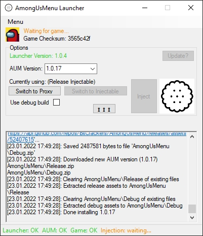

# aum-launcher  #
Parses list of releases from the [BitCrackers/AmongUsMenu](https://github.com/BitCrackers/AmongUsMenu) github repository.  
Allows you to download any release (main branch or feature branch).  
Depending on which option you choose, the launcher will either install version.dll to the game directory or inject AmongUsMenu.dll into the running game process.

## Screenshot ##

## How-To ##
1. Download the latest release of aum-launcher (https://github.com/BitCrackers/aum-launcher/releases/latest). You want to download aum-launcher.zip here.
2. Right-click the zip and extract to whatever folder you want.
3. Launch aum-launcher. Allow it through your firewall if prompted.
4. From the AUM Version dropdown box, select the desired version of AmongUsMenu you'd like. The latest main branch version should be at the top of the dropdown list (unless we mess up our version naming).
5. Wait for it to finish downloading and extracting. You can keep an eye on the log for this. The button with 3 up/down arrows will toggle the visibility of the log textbox.
6. Decide whether you want to use the Proxy version or the Injectable version. The proxy version will install version.dll into the game directory and this will automatically load AmongUsMenu into the game each time it's launched. The Injectable version will not install anything and instead you must inject it each time you launch the game.
7. Decide whether you want to use a debug build of AmongUsMenu. This will generate more verbose logs for developers to look at. Generally, you shouldn't need this unless you know what you're doing or a developer is helping you.
8. Launch the game and press inject if you're using the injectable version, otherwise just launch the game.

## FAQ ##
### What is the difference between Proxy and Injectable?  ###
Proxy will install version.dll into the game directory. This will automatically load AmongUsMenu each time the game is started.  
Injectable does not install anything and must be injected each time the game is started.

### What is debug build?  ###
The debug build will produce more verbose log files that you can send to the developers of AmongUsMenu if you're having issues.

### What if there's an update for AmongUsMenu?  ###
Simply select the latest version from the AUM Version dropdown box to download the update.

### What if there's an update for the Among Us game?  ###
There's a chance the latest version of AmongUsMenu will still work, but if not then just be patient and wait for an update. A checksum is generated from the game files and you can ask in the discord whether that checksum is supported.

### Do I need to allow it through my firewall?  ###
Yes, it needs to connect to the AmongUsMenu github to download the AmongUsMenu releases.

### Do you steal my data?  ###
No. Nothing is uploaded to us. Not even the log files.

### Is it a virus?  ###
No. aum-launcher and AmongUsMenu may trigger a false positive detection, but that's only because they may modify game code and some antiviruses don't like this. If you get either of those files from [BitCrackers/aum-launcher](https://github.com/BitCrackers/aum-launcher) or from [BitCrackers/AmongUsMenu](https://github.com/BitCrackers/AmongUsMenu) then you can rest assured it's safe.

### Why does a launcher have to modify game code? ###
Because it needs to put AmongUsMenu.dll inside the game process while it's running.

### How do I contact the devs or join the community? ###
aum-launcher and AmongUsMenu are built by the same devs and you can reach us at the BitCrackers discord server: https://discord.gg/AUpXd3VUh8

## Contributing ##
1. Fork it (https://github.com/BitCrackers/aum-launcher/fork)
2. Create your feature branch (`git checkout -b feature/fooBar`)
3. Commit your changes (`git commit -am 'Add some fooBar'`)
4. Push to the branch (`git push origin feature/fooBar`)
5. Create a new Pull Request